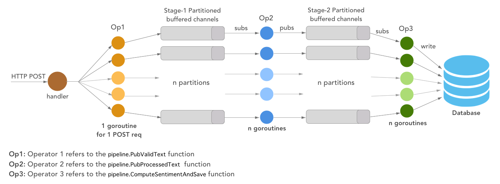

# sentiment-analysis
The sentiment-analysis service is demo service that can be used to perform community-level sentiment analysis on Twitter's data, as prescribed by the paper [PANAS-t: A Pychometric Scale for Measuring Sentiments on Twitter](https://arxiv.org/abs/1308.1857).

This service consumes [panas-go](https://github.com/coderafting/panas-go) library that I have open-sourced. The **panas-go** library offers utility data and functions that are described in the PANAS-t paper.

Please refer to the **SYSTEM DESIGN** section to understand the design of this service. Note that the service is for demonstration, any customization will depend upon your context and requirement.

## USAGE

### Run the service

The entry point of the service is `cmd/main.go`. The service has been tested with `Go 1.14` on `MacOS 10.15.6`.

Move to the root of this repo and run the following command from the terminal:
```Go
go run cmd/main.go

// With command-line flag:
// The <integer> indicates the maximum number of CPU processes the service can use.
// -p defaults to 4.
go run cmd/main.go -p <integer>
```

### Configurations
The server consumes a default configuration from the `config_file.yml` file.

In addition, a command-line flag, `-p`, has been provided for users to specify the maximum number of processes the service can consume. It defaults to `4`.

### Test
To run the tests from the root, for all the packages, please run:
```Go
go test ./...
```

### APIs
There are two HTTP api-endpoints available:

#### 1. POST `/text`

Accepts a `body` param as a json map with `textString` as key and a `string` as its value.

Returns a `json` map with key `Saved` and a `boolean` as its corresponding value.

Sample request:
```
// Request URL
http://localhost:3000/text

// Method
POST

// Content type
"application/json"

// Request Body:
{
    "textString": "I feel happy"
}
```

Sample response:
```
{
    "Saved": true
}
```

#### 2. GET `/sentiments`
Returns a `json` map with sentiment-categories as keys and sentiment details (a map) as their corresponding values.

Sample request:
```
// Request URL
http://localhost:3000/sentiments

// Method
GET
```

Sample response:
```
{
    "jovility": {
        "Value": 1,
        "TextCount": 1
    }
}
```

## SYSTEM DESIGN

The characteristics of the service is similar to a data processing pipeline, in which
1. the data gets in via an API,
2. data goes through a series of transformation stages, and
3. final results are written to a datastore.

This high-level data pipeline description can be implemented in different ways. This section describes the current implementation.

### Implementation

The current implementation is depicted in the image below:



1. **Data enters via an HTTP/POST route (/text):** The handler checks the validity of the incoming data, and triggers a goroutine that publishes the valid data to one of the stage-1 partitioned channels. The selection of the channel (**load-balancing**) in the partition happens in a **round-robin** fashion.

2. **Processing Pipeline:** There are goroutines initialized at the start of the app that are subscribed to the stage-1 partitioned channels. The number of goroutines are equal to the number of channels in the partition. These goroutines consume valid data from the stage-1 channels, process them, and publish the processed data to the stage-2 partitioned channels. Again, the selection of the channel (**load-balancing**) in the partition happens in a **round-robin** fashion.

3. **Compute and persist to DB:** There is another set of goroutines, which are also initialized at the start of the app. They are subscribed to the stage-2 partitioned channels. Again, the number of goroutines are equal to the number of channels in the partition. These goroutines consume processed data from from the stage-2 channels, perform computations by consuming the current state of the DB, and finally persist the result to the DB.

#### Performance-related configurations
The service exposes two configuration points that can help enhance the performance:
1. Number of partitions
2. Buffer size of the partitioned channels
3. Custom value for `GOMAXPROCS`

Partition count allows for horizontal scaling of the system, leading to a performance boost. However, it should be configured keeping the buffer size in mind. At the same time, increasing the number of partitions beyond the number of processes (`GOMAXPROCS`) a system can offer would not be helpful.


#### Other considerations
##### 1. Batch processing
Batch processing could help at the last leg of the pipeline, where goroutines are consuming from stage-2 partitions and interacting with the DB. Such a customization should be considered keeping the context and requirements in mind.

##### 2. Modularity
Similar to **DataStore** interface, you could have a **Pipeline** interface, which can be implemented by the current implementation.

### END